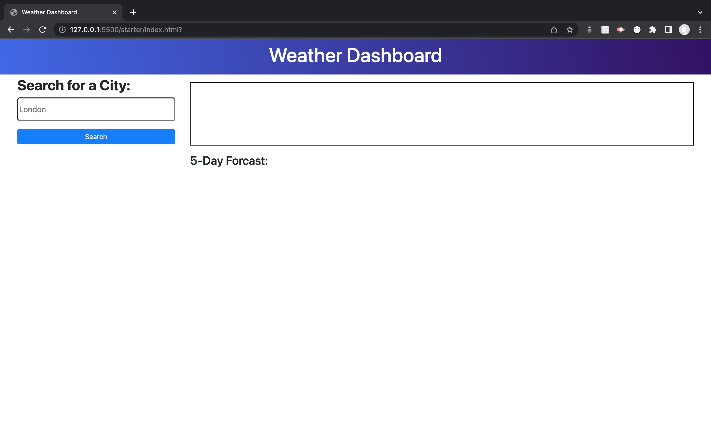
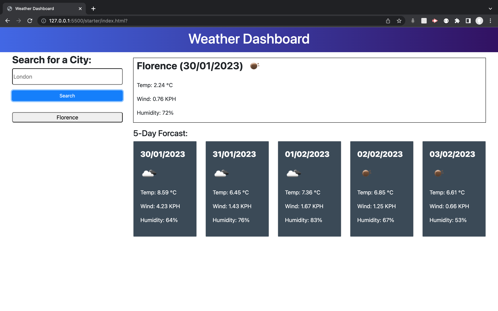
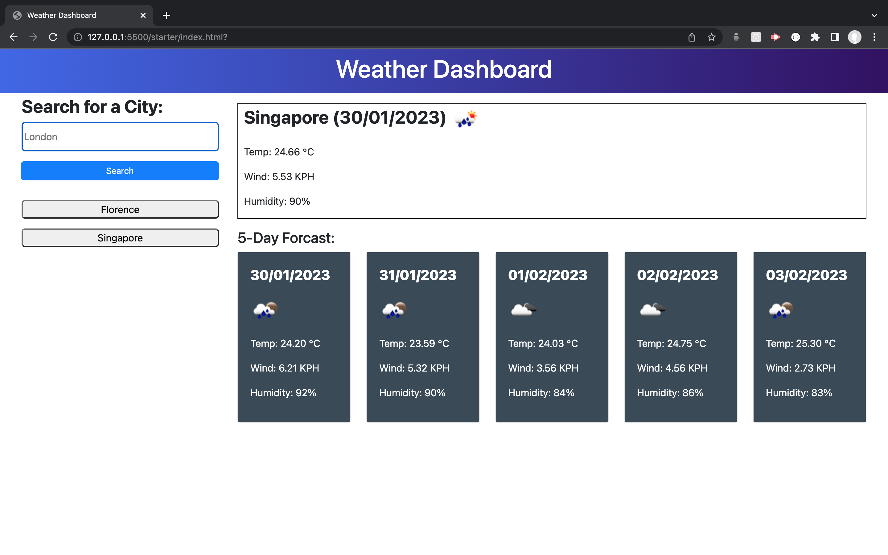

# The Weather Dashboard

## The deployed application

https://dantrovato.github.io/weather-dashboard/

A weather application for a user to input the name of a city and see today's weather in that city on the panel on the top right and the forecast for the next five days to the bottom right.

When a city is entered a button is created below the search button and can later be clicked to access the weather for that city again.

Below are some screenshots

Landing page on a first visit

After first city is entered

After second city is entered

